# Mini-Project: Automated Exam Proctoring System

Mini-Project is an Automated Exam Proctoring System (AEPS) developed with cutting-edge AI-based algorithms for online exams. This comprehensive system is designed to ensure the integrity and security of online examinations. The project leverages technologies such as React.js, Redux, Node.js, Express.js, MongoDB, and TensorFlow.js to offer a feature-rich exam proctoring solution.

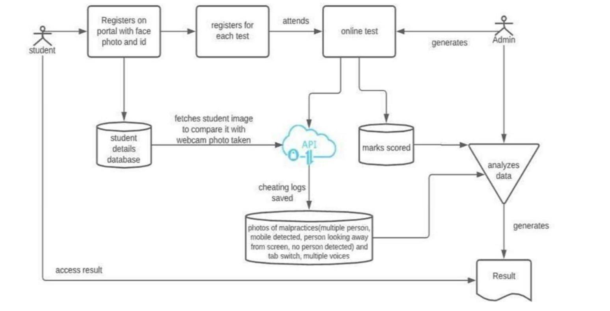

## Table of Contents

- [Tech Stack](#tech-stack)
  - [Backend](#backend)
  - [Frontend](#frontend)
- [Current Functionality](#current-functionality)
  - [User Authentication and Role Management](#user-authentication-and-role-management)
  - [Teacher Capabilities](#teacher-capabilities)
  - [Student Functionality](#student-functionality)
  - [AI Exam Proctoring](#ai-exam-proctoring)
- [Future Scope](#future-scope)
- [Project Screenshots](#project-screenshots)
- [How to Run](#how-to-run)
- [Contributors](#contributors)
- [License](#license)

## Tech Stack

Mini-Project utilizes a range of technologies to provide its comprehensive functionality. The key technologies and dependencies used in this project include:

### Backend

- **Node.js:** A JavaScript runtime for server-side development.
- **Express:** A minimal and flexible Node.js web application framework.
- **MongoDB:** A NoSQL database for storing user data.
- **Mongoose:** An elegant MongoDB object modeling tool.
- **JSON Web Tokens (JWT):** Used for secure authentication and authorization.
- **bcryptjs:** A library for securely hashing passwords.
- **PeerJS:** Used for WebRTC data and media connections.
- **Nodemailer:** Used for sending emails.

### Frontend

- **React:** A JavaScript library for building user interfaces.
- **Redux Toolkit:** A library for state management in React applications.
- **TensorFlow.js:** An open-source machine learning framework for web-based proctoring capabilities.
- **Material-UI (MUI):** A popular React UI framework.
- **React-Router:** A routing library for React applications.
- **React-Webcam:** A React component for capturing video from the user's webcam.
- **Formik & Yup:** Libraries for building forms with client-side validation.
- **SweetAlert & React-Toastify:** For displaying notifications and alert messages.

## Current Functionality

### User Authentication and Role Management

- Students and teachers can log in with separate roles and authenticated permissions.
- Secure token-based authentication (JWT) for user accounts.

### Teacher Capabilities

- Teachers can create and manage exams.
- Add customizable questions with negative marking features or custom exam instructions.
- Full access to the dashboard for reviewing student metrics and statistics.

### Student Functionality

- Students can view available or assigned exams and participate in them securely.
- Real-time test interface dynamically displaying questions, custom instructions, a live timer, and an auto-submit feature.

### AI Exam Proctoring

- Real-time AI proctoring of students during exams via desktop and "Third Eye" mobile camera functionalities.
- AI dynamically checks for cheating behaviors, such as mobile phone usage, multiple faces detection, and absence of detected faces.
- Suspicious incidents are logged and continuously viewable by teachers in their specific dashboard.

## Future Scope

### Candidate Verification

- Real-time identity verification prior to the exam start by validating the captured image against a registered profile.

### Voice Recognition

- Utilize voice recognition technology to monitor ambient room noise and identify voice anomalies during online exams, deterring potential collaboration.

### Secure Exam Environment

- Prevent candidates from opening or accessing unauthorized applications, browsing new tabs, or mitigating screen share risks on their devices during the exam.

### Unified Portal

- Expand the platform into a unified portal with built-in chat, a resource repository, and direct answer sheet scanning utilizing WebRTC and mobile devices.

## Project Screenshots

### Login Interfaces

- **Student Login**
  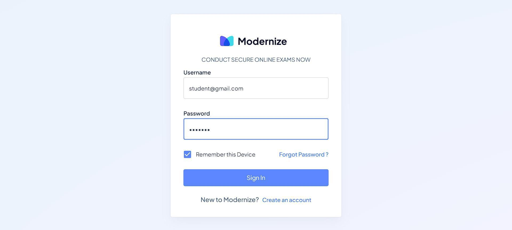

- **Teacher Login**
  

### Dashboards

- **Student Dashboard**
  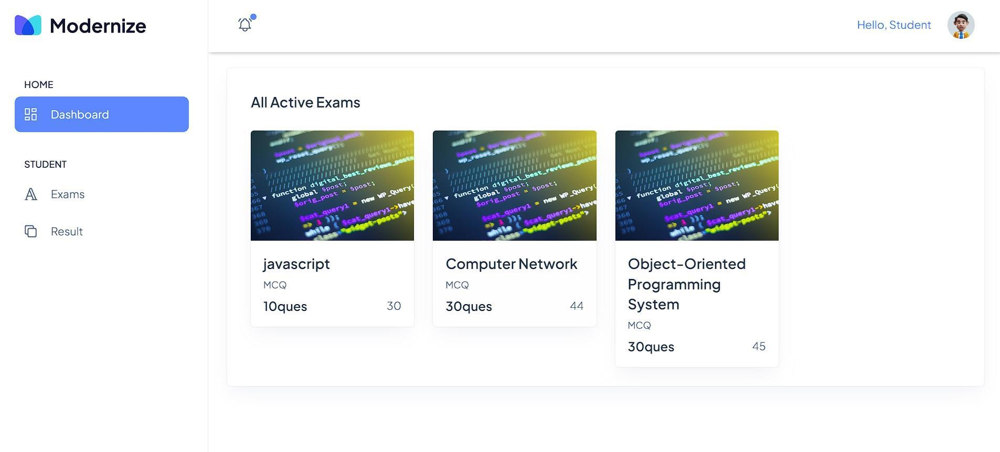

- **Teacher Dashboard**
  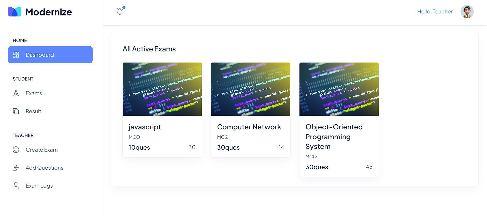

### Creating Exam Feature

- **Create Exam Settings**
  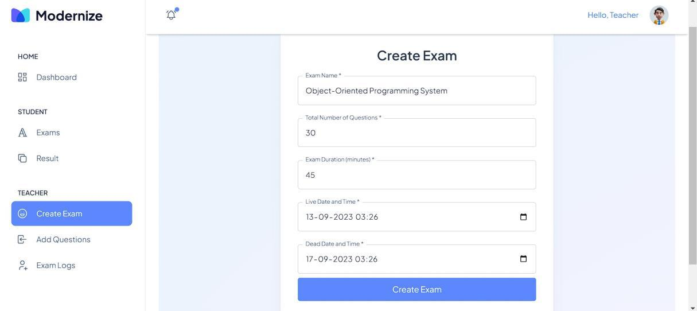

- **Create Questions**
  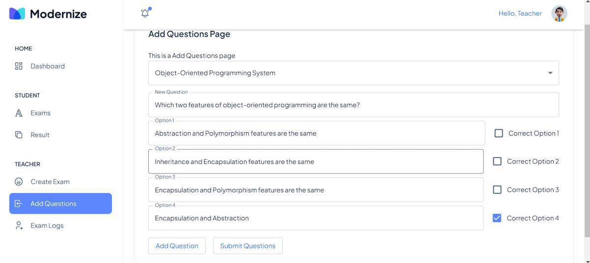

### Cheating Detection During Exam

*Webcam capture is hidden due to privacy constraints, displaying a black box over the live video feed during demonstration.*

- **Cell Phone Detection**
  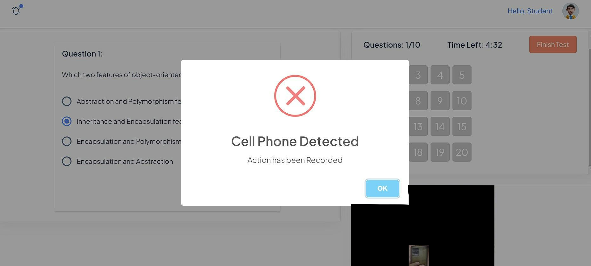

- **Prohibited Object Detection**
  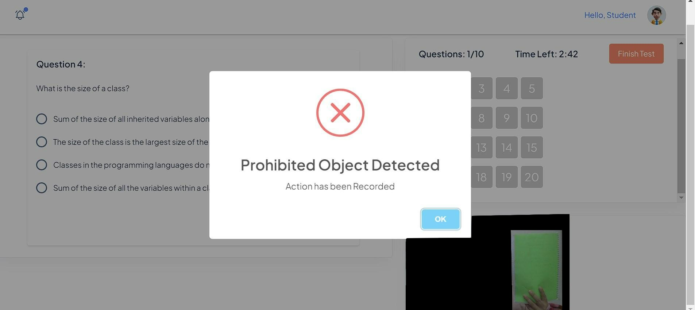

- **Face Not Visible Detection**
  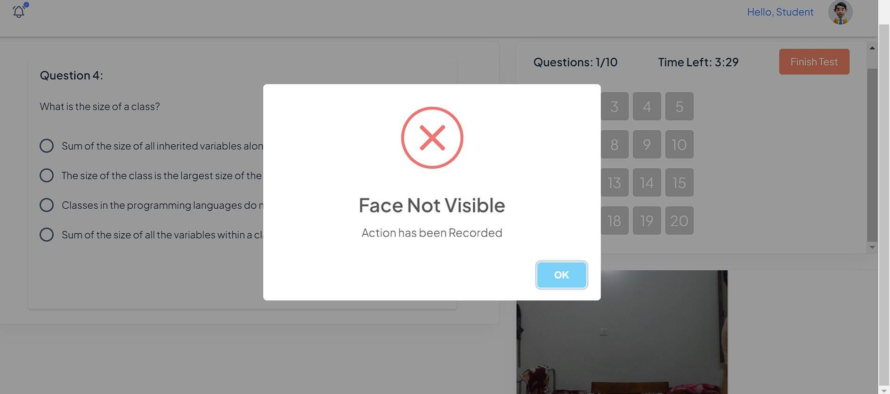

### Examination Workflow

- **Exam Warning Page**
  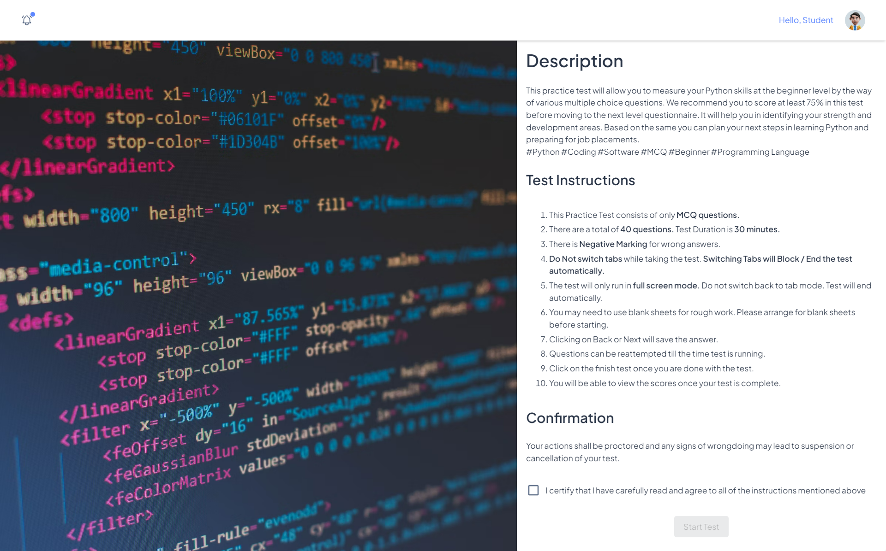

- **Exam Started Dashboard**
  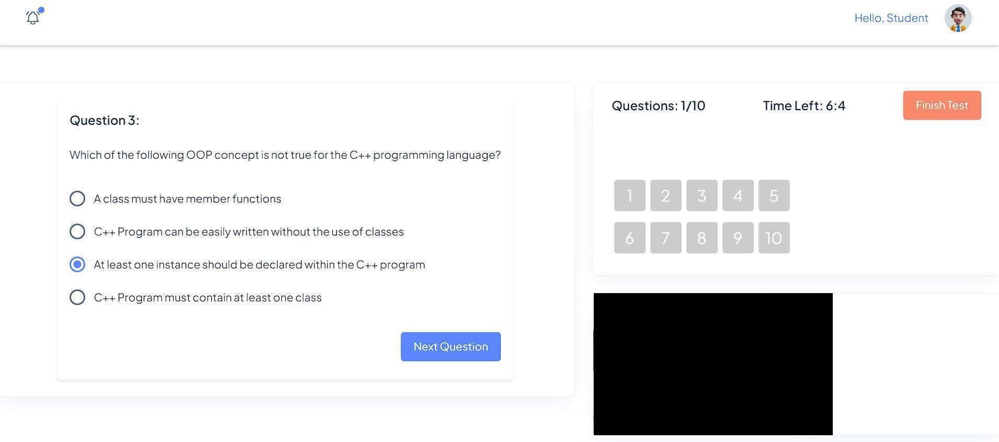

- **Detailed Cheat Log Information**
  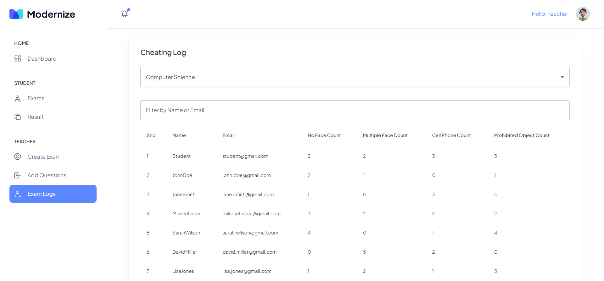

## How to Run

To run this project locally, follow these straightforward steps:

1. Clone this repository.
2. Ensure you have Node.js installed.
3. Install dependencies sequentially:
   - Root project: `npm install`
   - Backend: `cd backend && npm install`
   - Frontend: `cd ../frontend && npm install`
4. Set up environment variables locally. Ensure your `.env` references the connection strings for MongoDB, JWT configurations, etc.
5. In the root directory, run the comprehensive start command: `npm run dev` (this spins off both backend and frontend servers via concurrently).
   - Alternatively, start independently:
     - Backend: `cd backend && npm start`
     - Frontend: `cd frontend && npm start`
6. Access the application on `http://localhost:3000`.

## Contributors

- **Avinash Kumar** (AvinashKumar2202) and Team

## License

This project is intended for educational, portfolio, and demonstration purposes.
